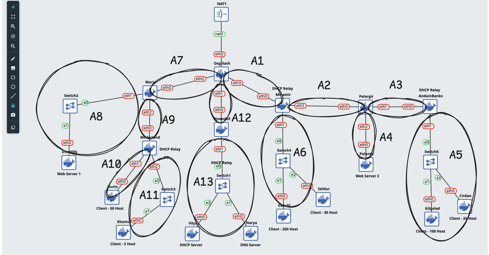
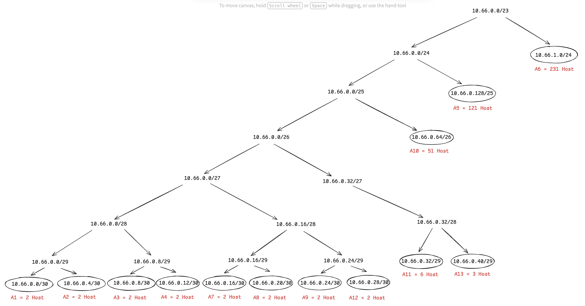

# Jarkom-Modul-5-2025-K-05

| No  | Nama anggota          | NRP        |
| --- | --------------------- | ---------- |
| 1.  | Adiwidya Budi Pratama | 5027241012 |
| 2.  | Ni'mah Fauziyyah Atok | 5027241103 |

---

# Modul 5 Jarkom

## Topologi dan Subnetting (VLSM)

Kebutuhan Host di Setiap Jaringan
|Subnet|Jumlah IP|Netmask|
|---|---|---|
| A1 | 2 | /30 |
| A2 | 2 | /30 |
| A3 | 2 | /30 |
| A4 | 2 | /30 |
| A5 | 121 | /25 |
| A6 | 231 | /24 |
| A7 | 2 | /30 |
| A8 | 2 | /30 |
| A9 | 2 | /30 |
| A10 | 51 | /26 |
| A11 | 6 | /29 |
| A12 | 2 | /30 |
| A13 | 3 | /29 |
| Total | 428 | /23 |

---

Pembagian subnetting dengan VLSM
| Subnet | Network ID | Netmask | Prefix | Broadcast | Range IP |
|---|---|---|---|---|---|
| A1 | 10.66.0.0 | 255.255.255.252 | /30 | 10.66.0.3 | 10.66.0.1 - 10.66.0.2 |
| A2 | 10.66.0.4 | 255.255.255.252 | /30 | 10.66.0.7 | 10.66.0.5 - 10.66.0.6 |
| A3 | 10.66.0.8 | 255.255.255.252 | /30 | 10.66.0.11 | 10.66.0.9 - 10.66.0.10 |
| A4 | 10.66.0.12 | 255.255.255.252 | /30 | 10.66.0.15 | 10.66.0.13 - 10.66.0.14 |
| A5 | 10.66.0.128 | 255.255.255.128 | /25 | 10.66.0.255 | 10.66.0.129 - 10.66.0.254 |
| A6 | 10.66.1.0 | 255.255.255.0 | /24 | 10.66.1.255 | 10.66.1.1 - 10.66.1.254 |
| A7 | 10.66.0.16 | 255.255.255.252 | /30 | 10.66.0.19 | 10.66.0.17 - 10.66.0.18 |
| A8 | 10.66.0.20 | 255.255.255.252 | /30 | 10.66.0.23 | 10.66.0.21 - 10.66.0.22 |
| A9 | 10.66.0.24 | 255.255.255.252 | /30 | 10.66.0.27 | 10.66.0.25 - 10.66.0.26 |
| A10 | 10.66.0.64 | 255.255.255.192 | /26 | 10.66.0.127 | 10.66.0.65 - 10.66.0.126 |
| A11 | 10.66.0.32 | 255.255.255.248 | /29 | 10.66.0.39 | 10.66.0.33 - 10.66.0.38 |
| A12 | 10.66.0.28 | 255.255.255.252 | /30 | 10.66.0.31 | 10.66.0.29 - 10.66.0.30 |
| A13 | 10.66.0.40 | 255.255.255.248 | /29 | 10.66.0.47 | 10.66.0.41 - 10.66.0.46 |
