# Jarkom-Modul-5-2025-K-05

| No  | Nama anggota          | NRP        |
| --- | --------------------- | ---------- |
| 1.  | Adiwidya Budi Pratama | 5027241012 |
| 2.  | Ni'mah Fauziyyah Atok | 5027241103 |

---

# Modul 5 Jarkom

## Topologi dan Subnetting (VLSM)


Kebutuhan Host di Setiap Jaringan
|Subnet|Jumlah IP|Netmask|
|---|---|---|
| A1 | 2 | /30 |
| A2 | 2 | /30 |
| A3 | 2 | /30 |
| A4 | 2 | /30 |
| A5 | 121 | /25 |
| A6 | 231 | /24 |
| A7 | 2 | /30 |
| A8 | 2 | /30 |
| A9 | 2 | /30 |
| A10 | 51 | /26 |
| A11 | 6 | /29 |
| A12 | 2 | /30 |
| A13 | 3 | /29 |
| Total | 428 | /23 |

---


Pembagian subnetting dengan VLSM
| Subnet | Network ID | Netmask | Prefix | Broadcast | Range IP |
|---|---|---|---|---|---|
| A1 | 10.66.0.0 | 255.255.255.252 | /30 | 10.66.0.3 | 10.66.0.1 - 10.66.0.2 |
| A2 | 10.66.0.4 | 255.255.255.252 | /30 | 10.66.0.7 | 10.66.0.5 - 10.66.0.6 |
| A3 | 10.66.0.8 | 255.255.255.252 | /30 | 10.66.0.11 | 10.66.0.9 - 10.66.0.10 |
| A4 | 10.66.0.12 | 255.255.255.252 | /30 | 10.66.0.15 | 10.66.0.13 - 10.66.0.14 |
| A5 | 10.66.0.128 | 255.255.255.128 | /25 | 10.66.0.255 | 10.66.0.129 - 10.66.0.254 |
| A6 | 10.66.1.0 | 255.255.255.0 | /24 | 10.66.1.255 | 10.66.1.1 - 10.66.1.254 |
| A7 | 10.66.0.16 | 255.255.255.252 | /30 | 10.66.0.19 | 10.66.0.17 - 10.66.0.18 |
| A8 | 10.66.0.20 | 255.255.255.252 | /30 | 10.66.0.23 | 10.66.0.21 - 10.66.0.22 |
| A9 | 10.66.0.24 | 255.255.255.252 | /30 | 10.66.0.27 | 10.66.0.25 - 10.66.0.26 |
| A10 | 10.66.0.64 | 255.255.255.192 | /26 | 10.66.0.127 | 10.66.0.65 - 10.66.0.126 |
| A11 | 10.66.0.32 | 255.255.255.248 | /29 | 10.66.0.39 | 10.66.0.33 - 10.66.0.38 |
| A12 | 10.66.0.28 | 255.255.255.252 | /30 | 10.66.0.31 | 10.66.0.29 - 10.66.0.30 |
| A13 | 10.66.0.40 | 255.255.255.248 | /29 | 10.66.0.47 | 10.66.0.41 - 10.66.0.46 |

---
# 📚 Laporan Praktikum Jaringan Komputer - Modul 5

## Misi 1

### 1.3. Konfigurasi Rute Antar Subnet

Tujuan: Membuat konfigurasi rute untuk menghubungkan semua subnet dengan benar. Pastikan perangkat dapat saling terhubung melalui router yang telah ditentukan.

#### 📸 Bukti

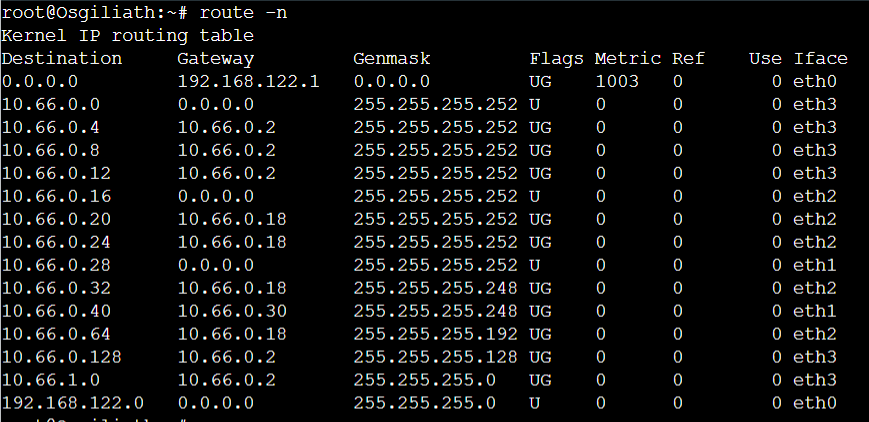
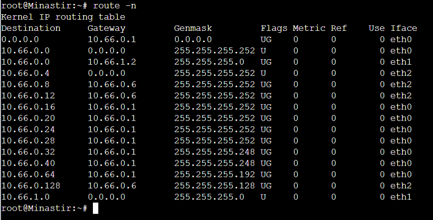
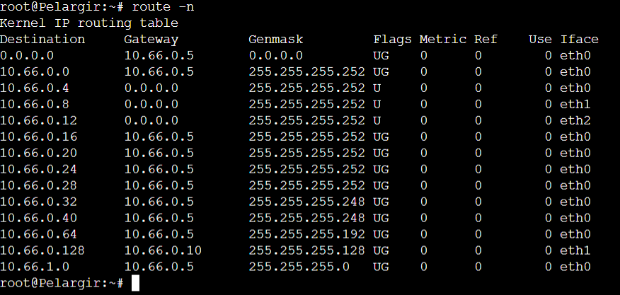
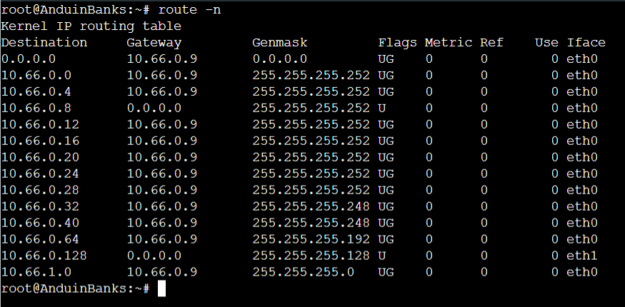
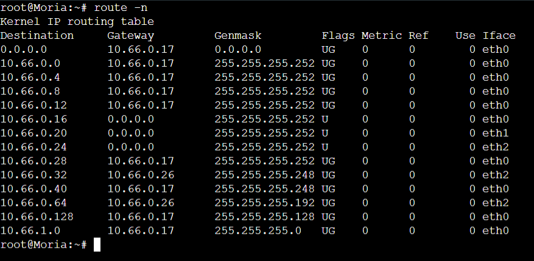
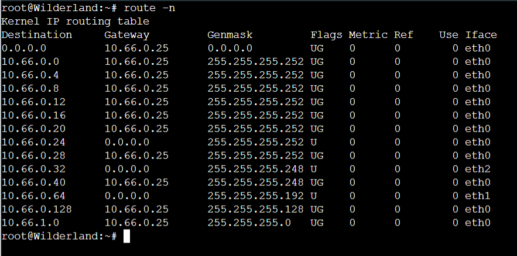


---

### 1.4. Konfigurasi Service

Tujuan: Melakukan konfigurasi service pada setiap perangkat yang ditugaskan untuk memastikan komunikasi jaringan berjalan dengan sempurna.

#### 1.4.1. DHCP Server (Vilya)

**Fungsi**: Vilya berfungsi sebagai DHCP Server agar perangkat dalam Khamul, Durin, Gilgalad, Elendil, Cirdan, dan Isildur menerima IP otomatis.

**Instalasi DHCP Server**
```bash
apt-get update
apt-get install isc-dhcp-server -y
```

**Konfigurasi DHCP Server (/etc/dhcp/dhcpd.conf)**
```
# Set interface yang melayani DHCP Relay
sed -i 's/INTERFACESv4=""/INTERFACESv4="eth0"/' /etc/default/isc-dhcp-server

# Konfigurasi dhcpd.conf
cat << EOF > /etc/dhcp/dhcpd.conf
# File konfigurasi utama DHCP Server Vilya (10.66.0.43)
ddns-update-style none;
default-lease-time 600;
max-lease-time 3600;
authoritative;
log-facility local7;

# Opsi umum
option domain-name "K05.com";
option domain-name-servers 10.66.0.42; # Narya DNS
option subnet-mask 255.255.255.248; # Subnet mask default untuk A13, tapi akan ditimpa di scope

# --- Deklarasi Subnet (Non-Client, Vilya/Narya) ---
subnet 10.66.0.40 netmask 255.255.255.248 {
}

# ----------------------------------------
# Scope untuk CLIENT yang mendapat IP Otomatis
# ----------------------------------------

# 1. Subnet A11: Khamul (5 Host) - 10.66.0.32/29
subnet 10.66.0.32 netmask 255.255.255.248 {
    range 10.66.0.35 10.66.0.38; 
    option routers 10.66.0.33; # Gateway Khamul: Wilderland
    option broadcast-address 10.66.0.39;
}

# 2. Subnet A10: Durin (50 Host) - 10.66.0.64/26
subnet 10.66.0.64 netmask 255.255.255.192 {
    range 10.66.0.67 10.66.0.126; 
    option routers 10.66.0.65; # Gateway Durin: Wilderland
    option broadcast-address 10.66.0.127;
}

# 3. Subnet A5: Gilgalad & Cirdan (121 Host) - 10.66.0.128/25
subnet 10.66.0.128 netmask 255.255.255.128 {
    range 10.66.0.132 10.66.0.254; 
    option routers 10.66.0.129; # Gateway A5: AnduinBanks
    option broadcast-address 10.66.0.255;
}

# 4. Subnet A6: Elendil & Isildur (231 Host) - 10.66.1.0/24
subnet 10.66.1.0 netmask 255.255.255.0 {
    range 10.66.1.4 10.66.1.254; 
    option routers 10.66.1.1; # Gateway A6: Minastir/Swath4
    option broadcast-address 10.66.1.255;
}

# Deklarasi host static Palantir (10.66.0.14) dan IronHills (10.66.0.22)
host palantir { fixed-address 10.66.0.14; }
host ironhills { fixed-address 10.66.0.22; }

EOF

# Restart DHCP Server
service isc-dhcp-server restart
```

#### 📸 Bukti DHCP Server

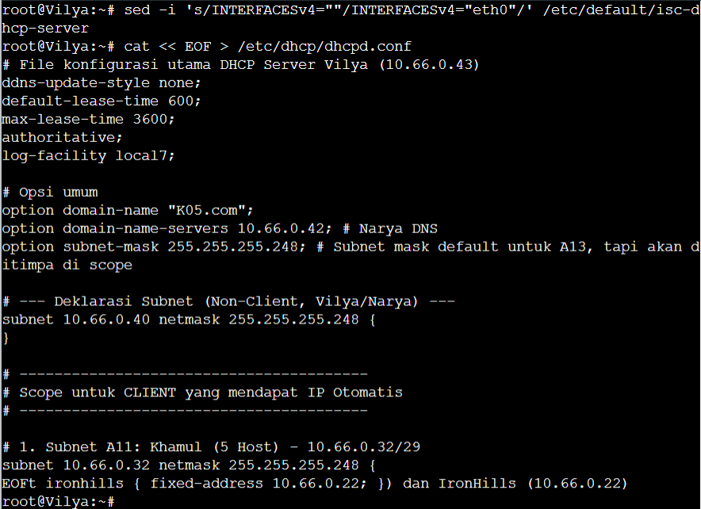

---

#### 1.4.2. DHCP Relay

**Fungsi**: AnduinBanks, Rivendell, Moria, Wilderland, dan Minastir berfungsi sebagai DHCP Relay untuk meneruskan DHCP Request dari klien ke DHCP Server (Vilya).

**Instalasi DHCP Relay**
```bash
apt-get update
apt-get install isc-dhcp-relay -y
```

**Konfigurasi DHCP Relay (/etc/default/isc-dhcp-relay)**
```
SERVERS="10.66.0.43"
INTERFACES="eth0 eth1"
OPTIONS=""
```

**Konfigurasi Sysctl (/etc/sysctl.conf)**
```
net.ipv4.ip_forward=1
```

**Aktifkan IP Forward**
```bash
sysctl -p
```

**Restart Service**
```bash
systemctl restart isc-dhcp-relay
systemctl enable isc-dhcp-relay
```

**Catatan**: Lakukan konfigurasi yang sama pada:
- AnduinBanks (Relay untuk A6)
- Rivendell (Relay untuk A11)
- Moria (Relay untuk A8, A9, A12, A13)
- Wilderland (Relay untuk A10)
- Minastir (Relay untuk A1, A2)

#### 📸 Bukti DHCP Relay

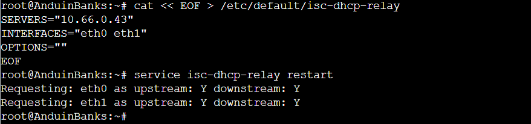


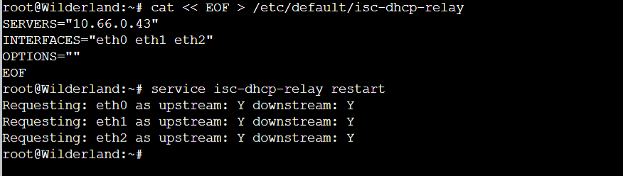
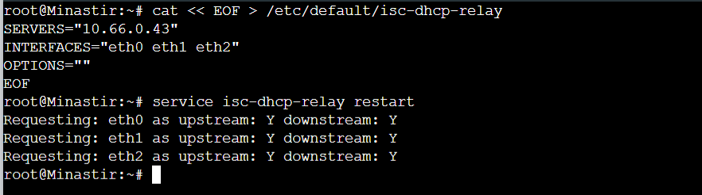

---

#### 1.4.3. DNS Server (Narya)

**Fungsi**: Narya berfungsi sebagai DNS Server untuk menerjemahkan nama domain menjadi alamat IP.

**Instalasi DNS Server**
```bash
apt-get update
apt-get install bind9 -y
```

**Konfigurasi Named (/etc/bind/named.conf.local)**
```
zone "jarkom.com" {
  type master;
  file "/etc/bind/db.jarkom.com";
};

zone "0.66.10.in-addr.arpa" {
  type master;
  file "/etc/bind/db.10.66.0";
};
```

**Konfigurasi Zone File (/etc/bind/db.jarkom.com)**
```
;
; BIND data file for jarkom.com
;
$TTL    604800
@       IN      SOA     narya.jarkom.com. root.jarkom.com. (
                              2         ; Serial
                         604800         ; Refresh
                          86400         ; Retry
                        2419200         ; Expire
                         604800 )       ; Negative Cache TTL
;
@       IN      NS      narya.jarkom.com.
narya   IN      A       10.66.0.35
palantir IN      A       10.66.0.37
ironhills IN     A       10.66.1.2
vilya   IN      A       10.66.0.43
```

**Konfigurasi Reverse Zone (/etc/bind/db.10.66.0)**
```
;
; BIND reverse data file for 10.66.0.0/16
;
$TTL    604800
@       IN      SOA     narya.jarkom.com. root.jarkom.com. (
                              2         ; Serial
                         604800         ; Refresh
                          86400         ; Retry
                        2419200         ; Expire
                         604800 )       ; Negative Cache TTL
;
@       IN      NS      narya.jarkom.com.
35.0    IN      PTR     narya.jarkom.com.
37.0    IN      PTR     palantir.jarkom.com.
43.0    IN      PTR     vilya.jarkom.com.
```

**Restart Service**
```bash
systemctl restart bind9
systemctl enable bind9
```

#### 📸 Bukti DNS Server

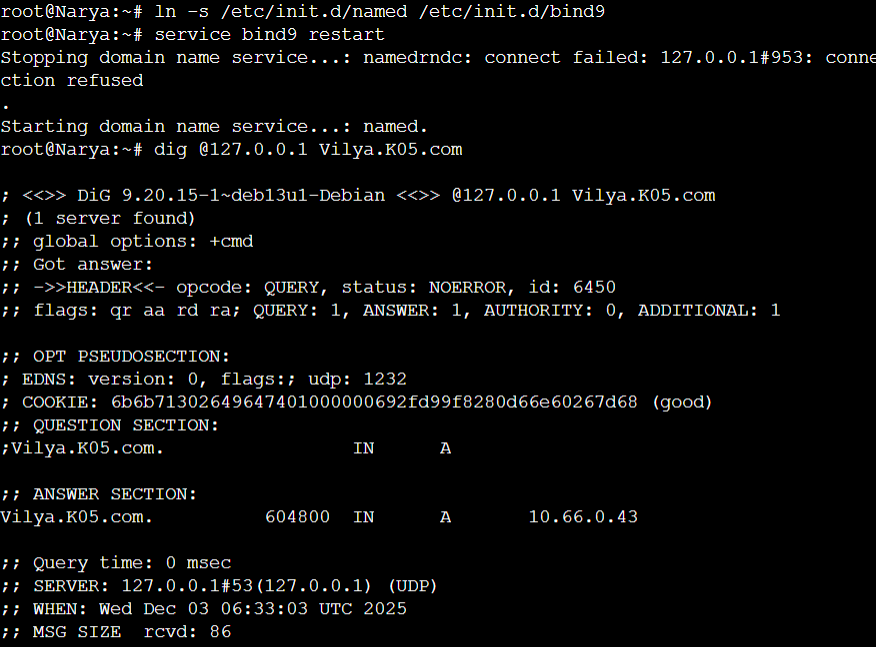

---

#### 1.4.4. Web Server (Palantir & IronHills)

**Fungsi**: Palantir dan IronHills berfungsi sebagai Web Server menggunakan Apache untuk melayani konten web.

**Instalasi Web Server (Apache)**
```bash
apt-get update
apt-get install apache2 -y
```

**Buat index.html berisikan: "Welcome to {hostname}". (Misi 1 No. 4)**
```
echo "<h1>Welcome to Palantir/Ironhills</h1>" > /var/www/html/index.html
service apache2 restart
```

**Lakukan konfigurasi yang sama pada:**
- Palantir (10.66.0.37)
- IronHills (10.66.1.2)

#### 📸 Bukti Web Server

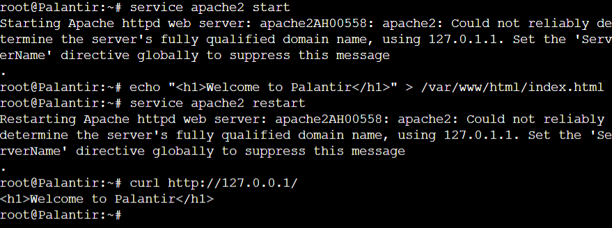
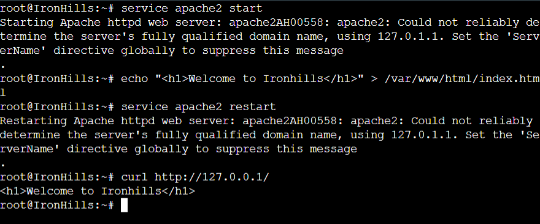


## Misi 2

### 2.1. NAT (SNAT) untuk Akses Keluar Jaringan (Osgiliath)

Tujuan: Memungkinkan jaringan internal Aliansi (10.66.0.0/23) terhubung ke luar (Valinor/Internet) menggunakan teknik Source NAT (SNAT), tanpa menggunakan target MASQUERADE.

#### 🛠️ Konfigurasi (Osgiliath)

```
# Ambil IP publik eth0 secara dinamis
export PUBLIC_IP=$(ip a show eth0 | grep 'inet ' | awk '{print $2}' | cut -d/ -f1)

# Hapus aturan POSTROUTING NAT yang mungkin ada
iptables -t nat -F POSTROUTING

# Tambahkan aturan SNAT (TIDAK MENGGUNAKAN MASQUERADE)
# Jaringan internal 10.66.0.0/23 (Total subnet) di-SNAT ke IP eth0 Osgiliath
iptables -t nat -A POSTROUTING -s 10.66.0.0/23 -o eth0 -j SNAT --to-source $PUBLIC_IP
```

### 2.2. Blokir PING ke Vilya (Vilya)

Tujuan: Melindungi server Vilya (penyimpan data vital) dari PING Request dari perangkat lain, namun tetap memungkinkan Vilya untuk PING keluar.

#### 🛠️ Konfigurasi (Vilya)

```
# Reset aturan Iptables
iptables -F
iptables -X

# 1. Izinkan Loopback dan Established
iptables -A INPUT -i lo -j ACCEPT
iptables -A INPUT -m state --state ESTABLISHED,RELATED -j ACCEPT

# 2. Blokir PING (ICMP Echo Request) dari perangkat lain (Misi 2 No. 2)
iptables -A INPUT -p icmp --icmp-type echo-request -j DROP
```

#### 📸 Bukti

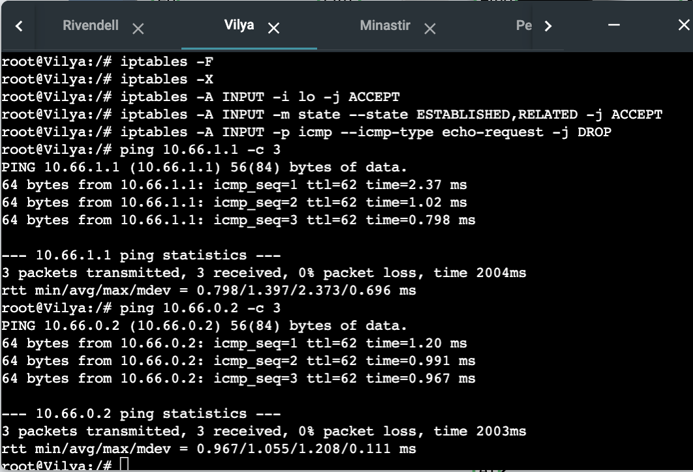
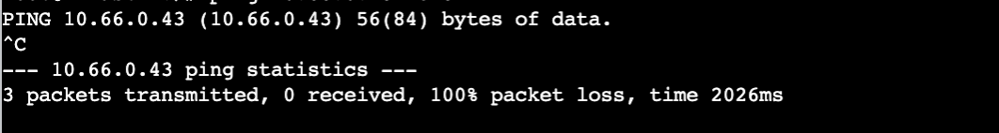

### 2.3. Batasi Akses DNS ke Narya (Narya)

Tujuan: Hanya Vilya (10.66.0.43) yang diizinkan untuk mengakses layanan DNS (port 53) pada server Narya, untuk mencegah kebocoran lokasi pasukan.

#### 🛠️ Konfigurasi (Narya)

```
# Reset aturan Iptables
iptables -F
iptables -X

# 2. Aturan ACCEPT HANYA untuk Vilya (10.66.0.43)
# Hanya Vilya yang dapat mengakses Narya (DNS).
iptables -A INPUT -p udp --dport 53 -s 10.66.0.43 -j ACCEPT
iptables -A INPUT -p tcp --dport 53 -s 10.66.0.43 -j ACCEPT

# 3. DROP semua akses DNS lainnya (dari mana pun)
iptables -A INPUT -p udp --dport 53 -j DROP
iptables -A INPUT -p tcp --dport 53 -j DROP
```

#### 📸 Bukti

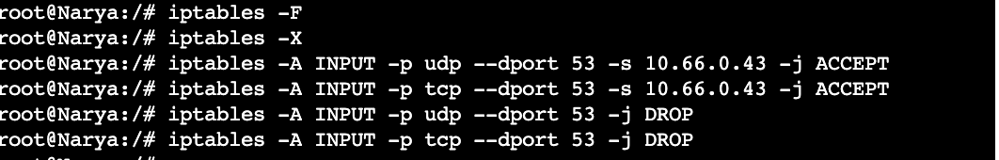


### 2.4. Pembatasan Akses Waktu (IronHills)

Tujuan: Membatasi akses ke IronHills hanya pada Akhir Pekan (Sabtu & Minggu) untuk Faksi Kurcaci & Pengkhianat (10.66.0.32/29, 10.66.0.64/26) dan Faksi Manusia (10.66.1.0/24). Akses harus ditolak pada hari kerja (misal: Rabu).

#### 🛠️ Konfigurasi (IronHills)

```
# ACCEPT akses pada hari Sabtu dan Minggu untuk IP yang diizinkan
iptables -A INPUT -s 10.66.0.32/29 -m time --weekdays Sat,Sun -j ACCEPT
iptables -A INPUT -s 10.66.0.64/26 -m time --weekdays Sat,Sun -j ACCEPT
iptables -A INPUT -s 10.66.1.0/24 -m time --weekdays Sat,Sun -j ACCEPT

# DROP akses pada hari-hari lain untuk IP yang diizinkan (dan semua IP yang belum ACCEPT)
iptables -A INPUT -s 10.66.0.32/29 -j DROP
iptables -A INPUT -s 10.66.0.64/26 -j DROP
iptables -A INPUT -s 10.66.1.0/24 -j DROP

# Aturan DROP final (jika ada)
iptables -A INPUT -j DROP
```

#### 📸 Bukti

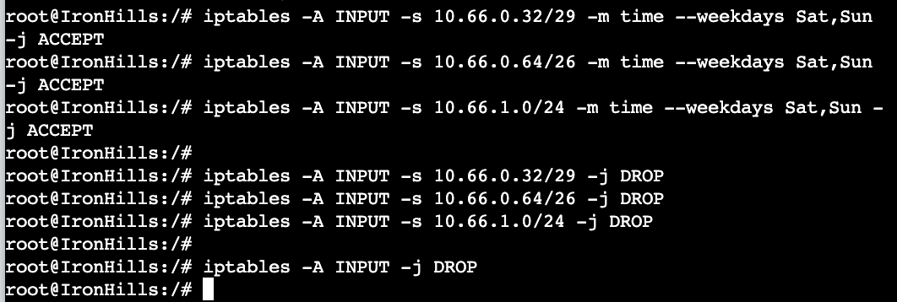


### 2.5. Pembatasan Akses Jam Kerja/Latihan (Palantir)

Tujuan: Membatasi akses ke server Palantir berdasarkan jam latihan masing-masing faksi: Elf (10.66.0.128/25) jam 07.00-15.00, dan Manusia (10.66.1.0/24) jam 17.00-23.00.

#### 🛠️ Konfigurasi (Palantir)

```
# ACCEPT akses Faksi Elf (Gilgalad & Cirdan) jam 07:00 - 15:00
iptables -A INPUT -s 10.66.0.128/25 -m time --timestart 07:00 --timestop 15:00 -j ACCEPT

# ACCEPT akses Faksi Manusia (Elendil & Isildur) jam 17:00 - 23:00
iptables -A INPUT -s 10.66.1.0/24 -m time --timestart 17:00 --timestop 23:00 -j ACCEPT

# DROP akses Faksi Elf di luar jamnya
iptables -A INPUT -s 10.66.0.128/25 -j DROP

# DROP akses Faksi Manusia di luar jamnya
iptables -A INPUT -s 10.66.1.0/24 -j DROP

# Aturan DROP final (jika ada)
iptables -A INPUT -j DROP
```

#### 📸 Bukti

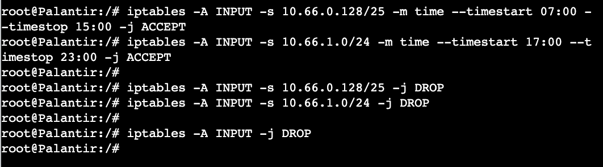

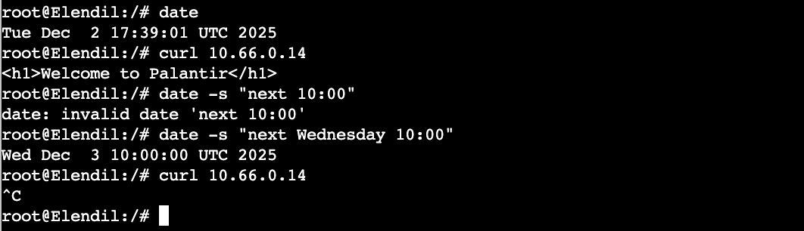

### 2.6. Mekanisme Deteksi Port Scan (Palantir)

Tujuan: Menerapkan pertahanan pada Palantir dengan memblokir alamat IP yang mencoba melakukan port scan (lebih dari 15 port baru dalam 20 detik). Penyerang yang terblokir harus kehilangan semua akses (PING, nc, curl).

#### 🛠️ Konfigurasi (Palantir)

```
# 1. Aturan Deteksi (Update dan DROP)
# Jika koneksi baru melebihi 15 dalam 20 detik, lompat ke rantai 'PORTSCAN' (log/drop)
iptables -A INPUT -p tcp -m state --state NEW -m recent --update --seconds 20 --hitcount 15 --name PORTSCAN -j LOG --log-prefix "PORT_SCAN_DETECTED "

# 2. Aturan Blokir (PORTSCAN chain)
# [Tambahkan aturan DROP atau REJECT di chain PORTSCAN, atau langsung DROP di INPUT]
# Karena tidak ada chain PORTSCAN, kita anggap aturan pertama akan memicu LOG
# dan aturan DROP sisa akan menangani setelah state NEW di-set.

# 3. Aturan Set (Mencatat koneksi baru)
# Mencatat setiap koneksi baru sebagai upaya port scan potensial
iptables -A INPUT -p tcp -m state --state NEW -m recent --set --name PORTSCAN

# 4. Izinkan Akses Web dan Koneksi Established
iptables -A INPUT -p tcp --dport 80 -j ACCEPT
iptables -A INPUT -m state --state ESTABLISHED,RELATED -j ACCEPT

# 5. Blokir sisa trafik (termasuk yang terkena recent --update/set)
iptables -A INPUT -j DROP
```

#### 📸 Bukti

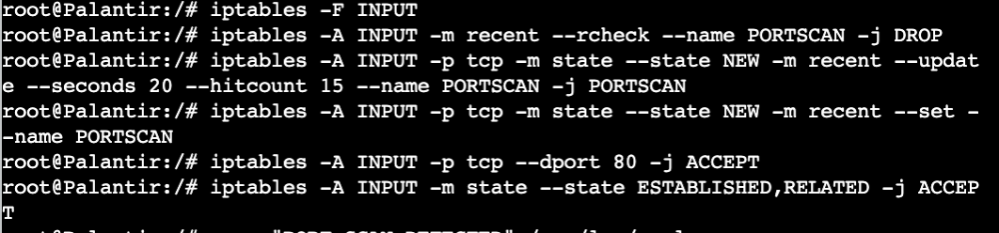
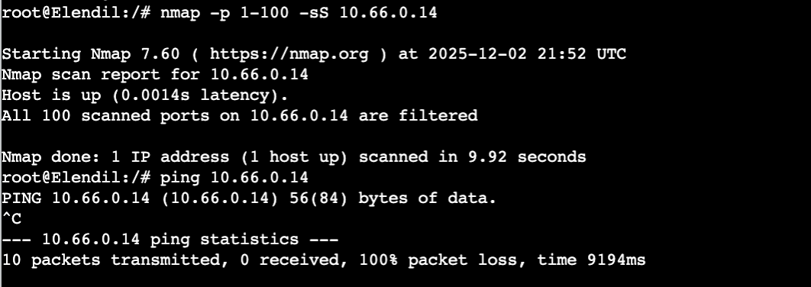

